# Multi-Tenant Warehouse Management SaaS

Backend-first Django REST Framework portfolio project for a multi-tenant warehouse management SaaS. The MVP demonstrates subdomain-based tenancy, JWT authentication, workspace role permissions, warehouse/catalog setup, transaction-safe inventory workflows, audit logs, dashboard APIs, API documentation, Dockerized development, and automated business-rule tests.

`docs/architecture.md` is the source of truth for the MVP architecture. `docs/project-brief.md` is background/original intent.

## Tech Stack

- Python 3.11
- Django 5
- Django REST Framework
- SimpleJWT
- PostgreSQL
- Redis
- Celery
- django-environ
- django-filter
- drf-spectacular
- pytest and pytest-django
- Docker Compose
- Next.js 16, React 19, and TypeScript
- Tailwind CSS and shadcn-style UI primitives
- TanStack Query

## MVP Features

- Email-based custom user model.
- JWT register, login, refresh, and profile endpoints.
- Workspace creation with automatic Owner membership.
- Subdomain-based tenant resolution with shared database/shared schema tenancy.
- Workspace memberships, roles, invites, invite acceptance, and member management.
- Owner, Admin, Manager, Staff, and Viewer permissions.
- Warehouse and warehouse-location setup with activate/deactivate lifecycle actions.
- Product categories, units of measure, products, SKU uniqueness, and active/inactive product lifecycle.
- Stock levels by product, warehouse, and location.
- Stock in, stock out, counted adjustment, and warehouse transfer operations.
- Transaction-safe stock mutations with row locking and rollback behavior.
- Append-only stock movement history.
- Audit logs for important workspace, setup, and inventory events.
- Tenant-scoped dashboard summary, low-stock, inventory-by-warehouse, and recent movement APIs.
- Page-number pagination, filtering, search, and ordering for list APIs.
- Swagger UI, OpenAPI schema, and ReDoc.
- Automated tests for the highest-risk business rules.
- Next.js frontend dashboard with HttpOnly JWT cookies, tenant-aware API forwarding, role-aware navigation, and inventory workflow screens.

## MVP Boundaries

The backend MVP intentionally excludes Stripe, billing, subscription plans, AI, receiving workflows, dispatch workflows, supplier/customer modules, email notifications, PDF reports, and CSV import/export. The frontend added afterward stays inside those same product boundaries.

## Architecture Highlights

The backend uses shared-schema multi-tenancy. Each tenant-owned model stores a `workspace` foreign key, while middleware resolves the active workspace from the request subdomain.

```mermaid
flowchart LR
    Client["API client"] --> Host["acme.localhost:8000"]
    Host --> Middleware["TenantMiddleware"]
    Middleware --> Workspace["Workspace by subdomain"]
    Workspace --> DRF["DRF view"]
    DRF --> Auth["JWT authentication"]
    Auth --> Membership["Active workspace membership"]
    Membership --> Role["Role permission"]
    Role --> Queryset["Tenant-scoped queryset"]
    Queryset --> Response["JSON response"]
```



Important security rule: the subdomain selects tenant context, but it is not the authorization boundary. Protected tenant APIs also require a valid JWT, active membership in `request.workspace`, and the correct role for the operation.

## App Structure

```text
backend/
  accounts/     email user model and JWT account APIs
  workspaces/   workspaces, memberships, invites, tenant middleware, role permissions
  warehouse/    warehouses and warehouse locations
  catalog/      categories, units, products, SKU rules
  inventory/    stock levels, stock movements, stock operation services
  audit/        audit log model, service, read-only APIs
  dashboard/    read-only reporting selectors and APIs
  common/       shared exceptions, mixins, pagination
  config/       settings, URLs, ASGI/WSGI, Celery
```

## Local Development Setup

Copy the example environment file if you want local overrides:

```powershell
Copy-Item .env.example .env
```

Build the images:

```powershell
docker compose build
```

Run database migrations:

```powershell
docker compose run --rm backend python manage.py migrate
```

Start the stack:

```powershell
docker compose up -d
```

The backend API runs at `http://localhost:8000`; the optional Next.js frontend service runs at `http://localhost:3000`.

The frontend uses `lvh.me` as the local shared-cookie domain so one frontend login works across workspace subdomains. Use tenant URLs such as `http://acme.lvh.me:3000/dashboard`. If you open `localhost` or `*.localhost` pages, the frontend redirects them to matching `lvh.me` URLs before login cookies are created.

For local frontend development outside Docker:

```powershell
cd frontend
npm install
npm run dev
```

Run Django checks:

```powershell
docker compose run --rm backend python manage.py check
```

Run tests:

```powershell
docker compose run --rm backend pytest
```

Run frontend checks:

```powershell
cd frontend
npm run lint
npm run typecheck
npm test
npm run build
```

Check Celery through Redis:

```powershell
docker compose exec backend python manage.py shell -c "from config.celery import celery_health_check; print(celery_health_check.delay().get(timeout=10))"
```

Stop services:

```powershell
docker compose down
```

## Environment Variables

`.env.example` documents the local variables used by Docker Compose:

- `DJANGO_SECRET_KEY`
- `DJANGO_DEBUG`
- `DJANGO_ALLOWED_HOSTS`
- `DATABASE_URL`
- `POSTGRES_DB`, `POSTGRES_USER`, `POSTGRES_PASSWORD`, `POSTGRES_HOST`, `POSTGRES_PORT`
- `REDIS_URL`
- `CELERY_BROKER_URL`
- `CELERY_RESULT_BACKEND`
- `BACKEND_INTERNAL_ORIGIN`
- `TENANT_BACKEND_HOST_SUFFIX`
- `FRONTEND_COOKIE_DOMAIN`
- `FRONTEND_BASE_DOMAIN`
- `NEXT_PUBLIC_FRONTEND_BASE_DOMAIN`
- `NEXT_PUBLIC_APP_NAME`

Docker Compose provides development defaults, so copying `.env.example` is optional for local development.

## Local Subdomain Setup

Tenant APIs rely on the request host. Preferred local tenant URLs:

```text
http://acme.localhost:8000/api/products/
http://tenant1.localhost:8000/api/products/
http://tenant2.localhost:8000/api/products/
http://acme.lvh.me:3000/dashboard
```

If your OS/browser does not resolve `*.localhost`, add hosts entries:

```text
127.0.0.1 acme.localhost
127.0.0.1 tenant1.localhost
127.0.0.1 tenant2.localhost
```

Alternative local wildcard-style domains:

```text
http://acme.lvh.me:8000
http://acme.localtest.me:8000
```

Root-domain APIs such as registration and workspace creation can use `localhost:8000`. Tenant-owned APIs such as products, warehouses, inventory, audit logs, and dashboard should use a tenant host such as `acme.localhost:8000`.

## API Documentation

With the backend service running:

- Swagger UI: `http://localhost:8000/api/docs/`
- OpenAPI schema: `http://localhost:8000/api/schema/`
- ReDoc: `http://localhost:8000/api/redoc/`

Swagger can also be opened from a tenant host, for example `http://acme.localhost:8000/api/docs/`, once that workspace exists.

## API Surface

Root/global endpoints:

| Method | Endpoint | Purpose |
|---|---|---|
| POST | `/api/auth/register/` | Register user |
| POST | `/api/auth/login/` | Get access and refresh tokens |
| POST | `/api/auth/token/refresh/` | Refresh access token |
| GET | `/api/auth/me/` | Get current user |
| PATCH | `/api/auth/me/` | Update profile name |
| POST | `/api/workspaces/create/` | Create workspace and Owner membership |
| GET | `/api/workspaces/` | List current user's active workspaces |

Tenant-scoped endpoints:

| Area | Endpoints |
|---|---|
| Workspace | `GET/PATCH /api/workspace/` |
| Members | `GET /api/members/`, `GET/PATCH /api/members/{id}/`, `POST /api/members/{id}/disable/` |
| Invites | `GET/POST /api/invites/`, `GET /api/invites/{id}/`, `POST /api/invites/{id}/cancel/`, `POST /api/invites/accept/` |
| Warehouse | `GET/POST /api/warehouses/`, `GET/PATCH /api/warehouses/{id}/`, `POST /api/warehouses/{id}/deactivate/`, `POST /api/warehouses/{id}/activate/` |
| Locations | `GET/POST /api/locations/`, `GET/PATCH /api/locations/{id}/`, `POST /api/locations/{id}/deactivate/`, `POST /api/locations/{id}/activate/` |
| Catalog | `GET/POST /api/categories/`, `GET/PATCH /api/categories/{id}/`, `GET/POST /api/units/`, `GET/PATCH /api/units/{id}/`, `GET/POST /api/products/`, `GET/PATCH /api/products/{id}/` |
| Inventory reads | `GET /api/stock-levels/`, `GET /api/stock-movements/` |
| Inventory actions | `POST /api/inventory/stock-in/`, `POST /api/inventory/stock-out/`, `POST /api/inventory/adjust/`, `POST /api/inventory/transfer/` |
| Audit | `GET /api/audit-logs/`, `GET /api/audit-logs/{id}/` |
| Dashboard | `GET /api/dashboard/summary/`, `GET /api/dashboard/low-stock/`, `GET /api/dashboard/inventory-by-warehouse/`, `GET /api/dashboard/recent-movements/` |

## Query Features

List APIs use page-number pagination:

```text
GET /api/products/?page=1&page_size=20
```

Defaults:

- Default `page_size`: `20`
- Maximum `page_size`: `100`
- Response shape: `count`, `next`, `previous`, `results`

Common query parameters:

- Products: `category`, `unit`, `is_active`, `search`, `ordering`
- Warehouses: `status`, `search`, `ordering`
- Locations: `warehouse`, `status`, `location_type`, `search`, `ordering`
- Stock levels: `product`, `warehouse`, `location`, `search`, `ordering`
- Stock movements: `movement_type`, `product`, `warehouse`, `location`, `created_at_after`, `created_at_before`, `search`, `ordering`
- Audit logs: `action`, `resource_type`, `resource_id`, `actor`, `created_at_after`, `created_at_before`, `search`, `ordering`

Tenant scoping happens before filtering, search, ordering, and pagination.

## Inventory Rules

- Stock quantities use decimal values with three decimal places.
- `stock_in` increases one stock level and creates a stock movement.
- `stock_out` decreases one stock level and cannot make stock negative.
- `adjust` sets stock to a counted quantity and records the difference.
- `transfer` decreases source stock and increases destination stock in one transaction.
- Transfers create `transfer_out` and `transfer_in` movement records with the same `transfer_batch_id`.
- Stock levels are read-only through public APIs.
- Stock movements are append-only through public APIs.
- Inactive products, warehouses, and locations cannot be used in new stock operations.
- Every successful stock mutation creates audit logs.

## Example API Flows

See [docs/api-examples.md](docs/api-examples.md) for cURL examples covering registration, workspace creation, tenant setup, stock operations, dashboard reads, filtering, and audit logs.

## Additional Docs

- [docs/architecture.md](docs/architecture.md): full architecture source of truth.
- [docs/architecture-summary.md](docs/architecture-summary.md): concise architecture notes and diagrams.
- [docs/api-examples.md](docs/api-examples.md): example API requests.
- [docs/portfolio-summary.md](docs/portfolio-summary.md): resume bullets, demo script, and screenshot checklist.

## Testing

The test suite uses `pytest` and `pytest-django` with `config.settings.test`.

```powershell
docker compose run --rm backend pytest
```

The suite covers authentication, tenancy, role permissions, invites, warehouse/catalog setup, inventory stock operations, transaction rollback, audit logs, dashboard tenant scoping, query features, and API docs smoke tests.

## Portfolio Highlights

- Designed and implemented subdomain-based multi-tenancy on a shared PostgreSQL schema.
- Enforced tenant isolation with middleware, membership validation, role permissions, and tenant-scoped querysets.
- Built transaction-safe inventory workflows with append-only stock movement history.
- Added audit logging for important workspace, setup, and stock mutation events.
- Exposed a documented REST API with Swagger/OpenAPI and pagination/filter/search/order support.
- Covered high-risk business rules with automated pytest tests running inside Docker.
- Built a role-aware Next.js SaaS dashboard with a BFF layer that keeps JWTs out of browser storage.

## Post-MVP Roadmap

Reasonable future improvements:

- Seed/demo data command.
- Swagger screenshots or demo GIFs for the repository.
- Supplier/customer modules.
- Receiving and dispatch workflows.
- CSV/PDF exports.
- Email notifications.
- Advanced reporting.
- Billing/Stripe integration.
- More advanced tenant isolation strategies for enterprise scenarios.
