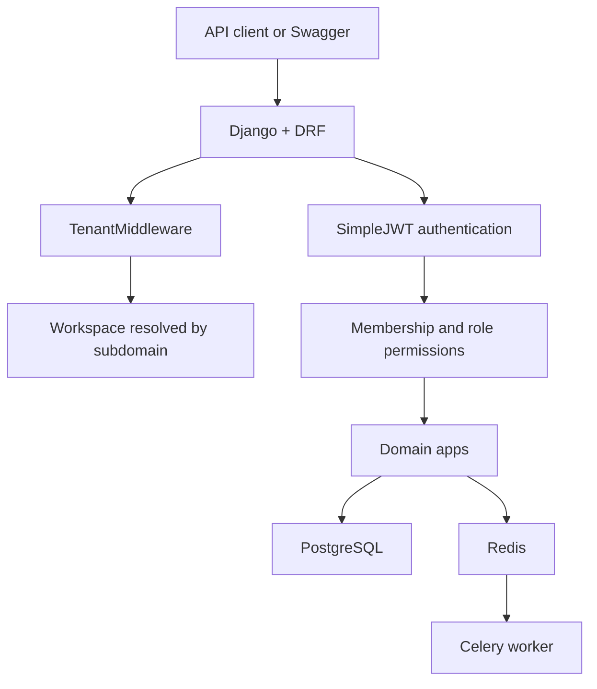
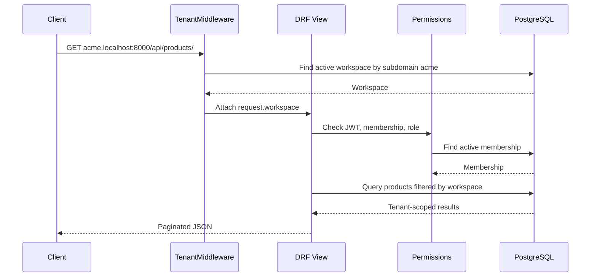
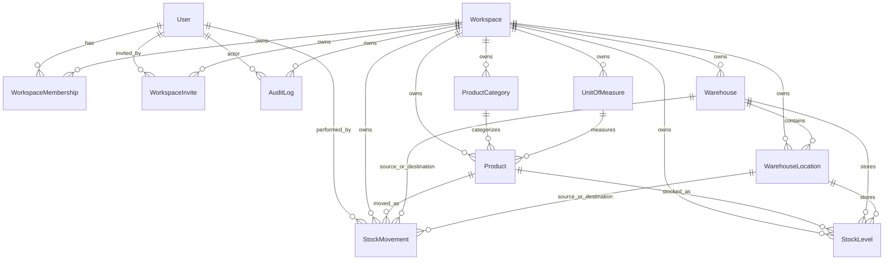
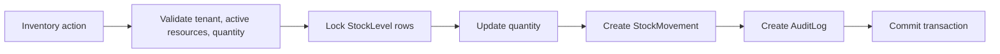

# Architecture Summary

This document summarizes the implemented MVP architecture. The detailed source of truth remains `docs/architecture.md`.

## System Shape

The project is a backend-first Django REST Framework SaaS-style API. Users are global. Workspaces are tenant containers. Tenant-owned data always belongs to a workspace and is accessed through a tenant subdomain.



## Tenancy Model

- Shared database, shared schema.
- Each tenant-owned model has a `workspace` foreign key.
- Middleware resolves `request.workspace` from hostnames such as `acme.localhost:8000`.
- Authorization requires a valid JWT and active membership in the resolved workspace.
- Querysets are scoped by `request.workspace` before filters, search, ordering, and pagination.



## Domain Apps

| App | Responsibility |
|---|---|
| `accounts` | Custom email user model and JWT account APIs |
| `workspaces` | Workspaces, memberships, invites, tenant middleware, role permissions |
| `warehouse` | Warehouses and warehouse locations |
| `catalog` | Categories, units, products, SKU uniqueness and lifecycle |
| `inventory` | Stock levels, stock movements, inventory services and action APIs |
| `audit` | AuditLog model, audit service, read-only audit API |
| `dashboard` | Tenant-scoped reporting selectors and read APIs |
| `common` | Shared exceptions, mixins, pagination |
| `config` | Settings, routing, Celery, ASGI/WSGI |

## Data Model Overview



## Role Model

| Role | Summary |
|---|---|
| Owner | Full workspace control |
| Admin | Manage users and operations except owner-only settings |
| Manager | Manage warehouse/catalog setup and inventory operations |
| Staff | Read setup data and perform stock in/out |
| Viewer | Read-only access |

## Inventory Workflow

Inventory writes live in `InventoryService` and run inside database transactions.



Rollback scenarios covered by tests include insufficient stock, failed transfer, and audit-log failure during stock mutation.

## API Quality

- Swagger UI at `/api/docs/`
- OpenAPI schema at `/api/schema/`
- ReDoc at `/api/redoc/`
- Page-number pagination with `page` and `page_size`
- Default page size `20`, maximum page size `100`
- `django-filter`, DRF search, and DRF ordering on important list APIs
- Consistent business error envelope:

```json
{
  "error": {
    "code": "validation_error",
    "message": "Insufficient stock for this operation.",
    "details": {}
  }
}
```

## MVP Boundary

The implemented MVP stays backend-first and avoids billing, Stripe, AI, frontend UI, receiving/dispatch workflows, email notifications, PDF reports, and CSV import/export.
